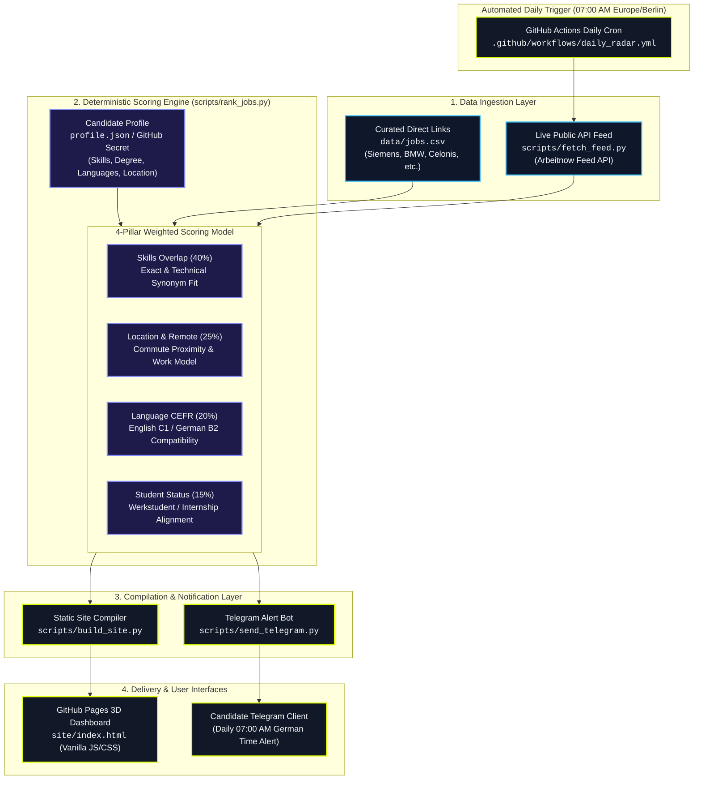
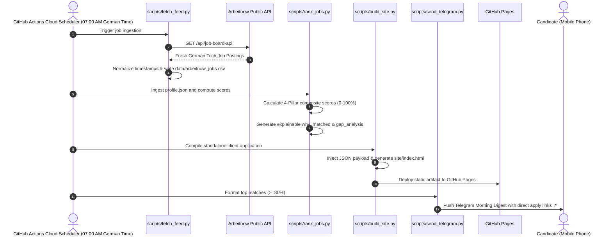

# 🎯 Job Radar — Automated Career Intelligence Engine

<div align="center">

[](https://github.com/srinivaspolanki/job-radar/actions/workflows/daily_radar.yml)
[](https://srinivaspolanki.github.io/job-radar/)
[](https://www.python.org/)
[](https://telegram.org/)

**A deterministic, privacy-preserving job intelligence engine that ingests German tech roles, scores them against a structured candidate profile across 4 weighted signals, deploys a standalone 3D dashboard to GitHub Pages, and delivers daily morning digests straight to Telegram.**

[Explore Live 3D Dashboard ↗](https://srinivaspolanki.github.io/job-radar/) · [Report Bug](https://github.com/srinivaspolanki/job-radar/issues) · [Request Feature](https://github.com/srinivaspolanki/job-radar/issues)

</div>

---

## 📌 Overview

**Job Radar** solves the noise in daily job hunting. Instead of manually parsing hundreds of unstructured listings across multiple portals every morning, Job Radar runs an automated **4-pillar deterministic ranking algorithm** at **07:00 AM German Time (Europe/Berlin)**, scores roles against a candidate profile (Skills, Location, Language CEFR, Working Student status), and delivers top matches directly to Telegram and a high-performance web dashboard.

### Key Highlights
- **🔒 Privacy-by-Design**: Candidate CV and profile data remain 100% private in local configuration and ephemeral GitHub Secrets—never committed to source control or exposed in production builds.
- **⚡ Deterministic Scoring Engine**: Pure algorithmic scoring across 4 transparent pillars with explainable matching rationales and gap analyses.
- **📱 Automated Telegram Alerts**: Real-time morning push notifications featuring direct 1-tap application links.
- **🌐 3D Interactive Dashboard**: Modern, cyber-racing inspired static web client built with Vanilla JS/CSS, 3D scroll perspectives, dynamic filters, and zero backend maintenance costs.

---

## 🏗️ System Architecture



---

## 🔄 Daily Execution Flow



---

## 📊 The 4-Pillar Scoring Model

| Pillar | Weight | Evaluation Criteria | Scoring Logic |
| :--- | :---: | :--- | :--- |
| **1. Technical Skills** | **40%** | Hard skills, tools, frameworks, and domain synonyms | Base overlap score + synonym graph match (e.g. `ROS 2` $\leftrightarrow$ `Robotics`, `FastAPI` $\leftrightarrow$ `Python`). |
| **2. Location & Remote** | **25%** | Proximity to target cities & work arrangement | Full score for 100% Remote or target cities (e.g., Hof, Munich, Nuremberg); partial score for hybrid roles in Bavaria. |
| **3. Language Proficiency** | **20%** | CEFR language requirements vs. candidate proficiencies | Compares candidate proficiencies (e.g., English C1, German B2) against job posting requirements. |
| **4. Student & Role Fit** | **15%** | Working Student (*Werkstudent*) / Intern qualification | Matches enrolled master's student status with student-eligible listings. |

---

## 📁 Repository Structure

```text
job-radar/
├── .github/
│   └── workflows/
│       └── daily_radar.yml       # Automated GitHub Actions workflow (07:00 AM German Time)
├── data/
│   ├── jobs.csv                  # Curated direct company listings (Siemens, BMW, Celonis, etc.)
│   └── arbeitnow_jobs.csv        # Normalized live public feed from Arbeitnow API
├── scripts/
│   ├── fetch_feed.py             # Public feed ingestion and timestamp normalization
│   ├── rank_jobs.py              # 4-signal deterministic ranking algorithm
│   ├── build_site.py             # Static HTML/CSS/JS compiler
│   └── send_telegram.py          # Telegram morning digest alert engine
├── site/
│   ├── css/
│   │   └── style.css             # Cyber-racing theme, 3D scroll perspective & responsive layout
│   ├── js/
│   │   └── app.js                # Search, dynamic filters, scroll reveals & telemetry modal
│   └── index.html                # Compiled standalone production dashboard
├── .env.example                  # Environment configuration template
├── cron.example                  # Local Linux/macOS crontab template
├── profile.example.json          # Sanitized candidate profile template
├── profile.json                  # Active candidate profile (Git-ignored for privacy)
├── run_daily_refresh.sh          # 1-click executable refresh pipeline
└── README.md                     # Engineering documentation
```

---

## 🚀 Quick Start (Local Setup)

### 1. Clone & Configure Candidate Profile
```bash
git clone https://github.com/srinivaspolanki/job-radar.git
cd job-radar

# Create your private candidate profile from the template:
cp profile.example.json profile.json
# Edit profile.json with your skills, degree, target locations, and languages
```

### 2. Run the Daily Pipeline
```bash
./run_daily_refresh.sh
```

### 3. Launch Local Dashboard
```bash
python3 -m http.server 8080 --directory site
# Visit http://localhost:8080 in your browser
```

---

## 📱 Telegram Morning Alert Setup

Every morning at **07:00 AM German Time (Europe/Berlin)**, Job Radar delivers a curated summary of top matching positions directly to your phone.

### 1. Create a Telegram Bot
1. In Telegram, search for [`@BotFather`](https://t.me/BotFather) and send `/newbot`.
2. Follow the prompts to create your bot and copy the **HTTP API Token**.

### 2. Get Your Personal Chat ID
1. Search for [`@userinfobot`](https://t.me/userinfobot) in Telegram and press **Start** to view your numerical ID.
2. Open a chat with your newly created bot and press **Start**.

### 3. Configure Local Credentials
```bash
cp .env.example .env
# Edit .env and set your TELEGRAM_BOT_TOKEN and TELEGRAM_CHAT_ID

# Verify connection:
python3 scripts/send_telegram.py --test
```

---

## ☁️ Cloud CI/CD & GitHub Pages Deployment

Job Radar is designed for **zero-maintenance, zero-cloud-cost continuous operation** via GitHub Actions.

### 1. Set Repository Secrets
In your GitHub repository, navigate to **Settings > Secrets and variables > Actions** and add:

| Secret Name | Value | Description |
| :--- | :--- | :--- |
| `JOB_RADAR_PROFILE` | Contents of `profile.json` | Candidate profile data *(keeps your CV private)* |
| `TELEGRAM_BOT_TOKEN` | `123456:ABC-DEF...` | Telegram bot token from `@BotFather` |
| `TELEGRAM_CHAT_ID` | `987654321` | Numerical Telegram user ID from `@userinfobot` |
| `DASHBOARD_URL` | `https://<user>.github.io/<repo>/` | URL of your deployed GitHub Pages dashboard |

### 2. Enable GitHub Pages
1. Go to **Settings > Pages**.
2. Under **Build and deployment > Source**, select **GitHub Actions**.

### 3. Execution Schedule
The pipeline triggers automatically every morning at **07:00 AM German Time** (and on every push to `main`):
- Ingests fresh postings from German feeds.
- Computes matching scores against the encrypted repository profile secret.
- Compiles and publishes the static web application to GitHub Pages.
- Pushes the morning digest with 1-tap application links to your Telegram app.

---

## 👤 Author

**Polanki Srinivas**  
*M.Sc. Artificial Intelligence and Robotics — Hochschule Hof, Germany*  
- **Email**: [srinivaspolankis@gmail.com](mailto:srinivaspolankis@gmail.com)  
- **GitHub**: [@srinivaspolanki](https://github.com/srinivaspolanki)  
- **Live Job Radar**: [https://srinivaspolanki.github.io/job-radar/](https://srinivaspolanki.github.io/job-radar/)
