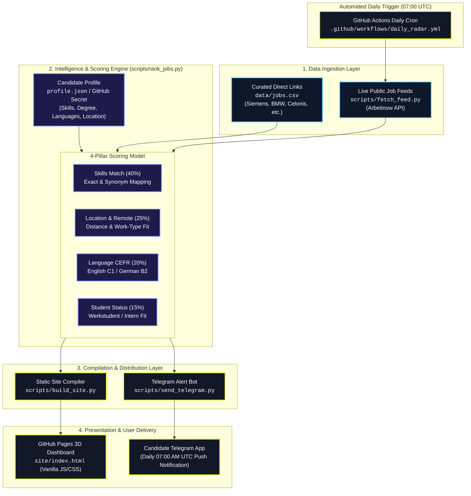
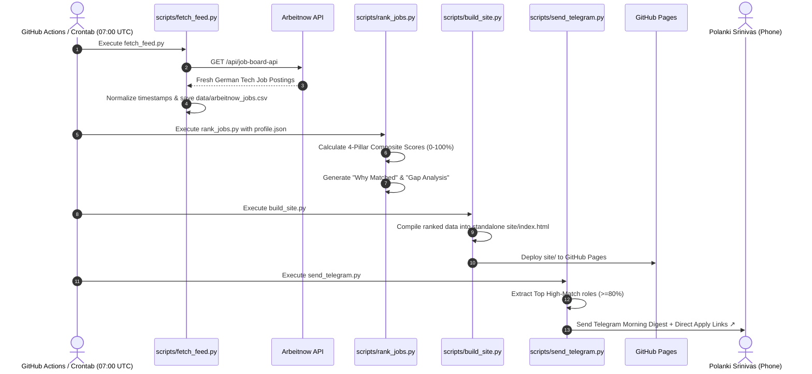

# Job Radar (Werkstudent & Junior Tech)

A privacy-minimized, automated career intelligence system that ingests German tech job listings, scores them against a structured candidate profile using a 4-pillar deterministic ranking engine, deploys a standalone 3D interactive dashboard to GitHub Pages, and delivers daily morning digests straight to Telegram.

---

## System Architecture



---

## Daily Execution Sequence



---

## Component Breakdown

| Component | File Path | Responsibility |
| :--- | :--- | :--- |
| **Candidate Profile** | [`profile.json`](file:///home/srinivas/Desktop/agent/profile.json) | Stores candidate skills, degree, target locations, and language CEFR levels *(Git-ignored for privacy)*. |
| **Profile Template** | [`profile.example.json`](file:///home/srinivas/Desktop/agent/profile.example.json) | Public template for setting up custom candidate profiles. |
| **Feed Fetcher** | [`scripts/fetch_feed.py`](file:///home/srinivas/Desktop/agent/scripts/fetch_feed.py) | Ingests and normalizes live working student and tech roles from public feeds. |
| **Ranking Engine** | [`scripts/rank_jobs.py`](file:///home/srinivas/Desktop/agent/scripts/rank_jobs.py) | Deterministic 4-signal scoring engine (Skills, Location, Language, Student status). |
| **Site Compiler** | [`scripts/build_site.py`](file:///home/srinivas/Desktop/agent/scripts/build_site.py) | Generates zero-dependency static HTML/CSS/JS ready for GitHub Pages. |
| **Telegram Notifier** | [`scripts/send_telegram.py`](file:///home/srinivas/Desktop/agent/scripts/send_telegram.py) | Formats and dispatches top match alerts to Telegram with 1-tap apply links. |
| **Refresh Pipeline** | [`run_daily_refresh.sh`](file:///home/srinivas/Desktop/agent/run_daily_refresh.sh) | 1-click executable running the full 3-step ingestion, scoring, and alerting pipeline. |
| **Cloud Automation** | [`.github/workflows/daily_radar.yml`](file:///home/srinivas/Desktop/agent/.github/workflows/daily_radar.yml) | Daily 07:00 AM UTC GitHub Actions workflow deploying to Pages and alerting Telegram. |

---

## 🔒 Privacy-by-Design Architecture

1. **Local Privacy**: Your personal `profile.json` and `.env` credentials are git-ignored and never committed to source control.
2. **Cloud Ephemeral Build**: The GitHub Actions workflow restores your profile in-memory from a repository secret (`JOB_RADAR_PROFILE`), executes the scoring engine, and deletes `profile.json` before publishing the artifact.
3. **Zero Backend Exposure**: Only the pre-compiled static files inside `site/` are published to GitHub Pages.

---

## 🚀 Quick Start

### 1. Configure Your Candidate Profile
```bash
cp profile.example.json profile.json
# Adjust profile.json with your skills, degree, and languages
```

### 2. Run Daily Refresh
```bash
./run_daily_refresh.sh
```

### 3. View the 3D Dashboard Locally
```bash
python3 -m http.server 8080 --directory site
# Open http://localhost:8080 in your browser
```

---

## 📱 Telegram Morning Alert Setup

Every morning at 07:00 AM UTC (09:00 AM German time), Job Radar delivers a digest of the top ranked jobs to your Telegram chat.

### 1. Create a Telegram Bot (30 seconds)
1. Open Telegram and search for [`@BotFather`](https://t.me/BotFather).
2. Send `/newbot`, choose a name (e.g. `MyJobRadarBot`) and username (e.g. `srinivas_job_radar_bot`).
3. Copy the **HTTP API Token** (e.g. `123456789:ABCdefGhIJKlmNoPQRsTUVwxyZ`).

### 2. Get Your Personal Chat ID (10 seconds)
1. In Telegram, search for [`@userinfobot`](https://t.me/userinfobot) and press **Start**.
2. Copy your numerical **Id** (e.g. `987654321`).
3. Send `/start` to your newly created bot.

### 3. Configure & Test Locally
```bash
cp .env.example .env
# Fill in TELEGRAM_BOT_TOKEN and TELEGRAM_CHAT_ID
python3 scripts/send_telegram.py --test
```

---

## 🌐 GitHub Pages Deployment & Cloud Setup

1. Push this repository to GitHub (Public or Private):
   ```bash
   git remote add origin https://github.com/<YOUR_USERNAME>/job-radar.git
   git push -u origin main
   ```
2. In your GitHub repo, go to **Settings > Secrets and variables > Actions** and add:
   - `JOB_RADAR_PROFILE`: Paste contents of your local `profile.json`.
   - `TELEGRAM_BOT_TOKEN`: Your Telegram Bot Token.
   - `TELEGRAM_CHAT_ID`: Your Telegram Chat ID.
   - `DASHBOARD_URL`: `https://<YOUR_USERNAME>.github.io/job-radar/`
3. Go to **Settings > Pages** and set **Source** to **GitHub Actions**.
4. GitHub Actions will now automatically update your site and notify your Telegram every morning at 07:00 UTC!
